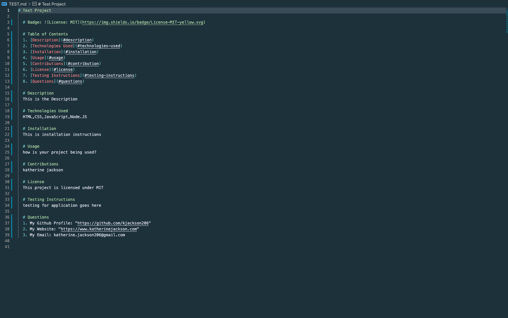

# 09 Node.js Homework: Professional README Generator

# Badge: 

# Table of Contents

1. [Description](#description)
2. [Technologies Used](#technologies-used)
3. [Installation](#installation)
4. [Usage](#usage)
5. [Contributions](#contribution)
6. [License](#license)
7. [Testing Instructions](#testing-instructions)
8. [Questions](#questions)

# Description

This application is used to create a streamlined and robust README for your project.

# Technologies Used

HTML
CSS
JavaScript
Node.JS

# Installation

None

# Usage

You will answer a series of questions in your terminal that will create a README.md within your project's folder.

Then you will be able to see the file populate within your VSCode

From there, you can commit your README.md to your GirHub Repo and see it

# Contributions

None

# License

This project is licensed under MIT

# Testing Instructions

I tested this project using Node.JS

# Questions

1. My Github Profile: https://github.com/kjackson206
2. This Project: https://kjackson206.github.io/readme-generator/
3. My Email: katherine.jackson206@gmail.com
